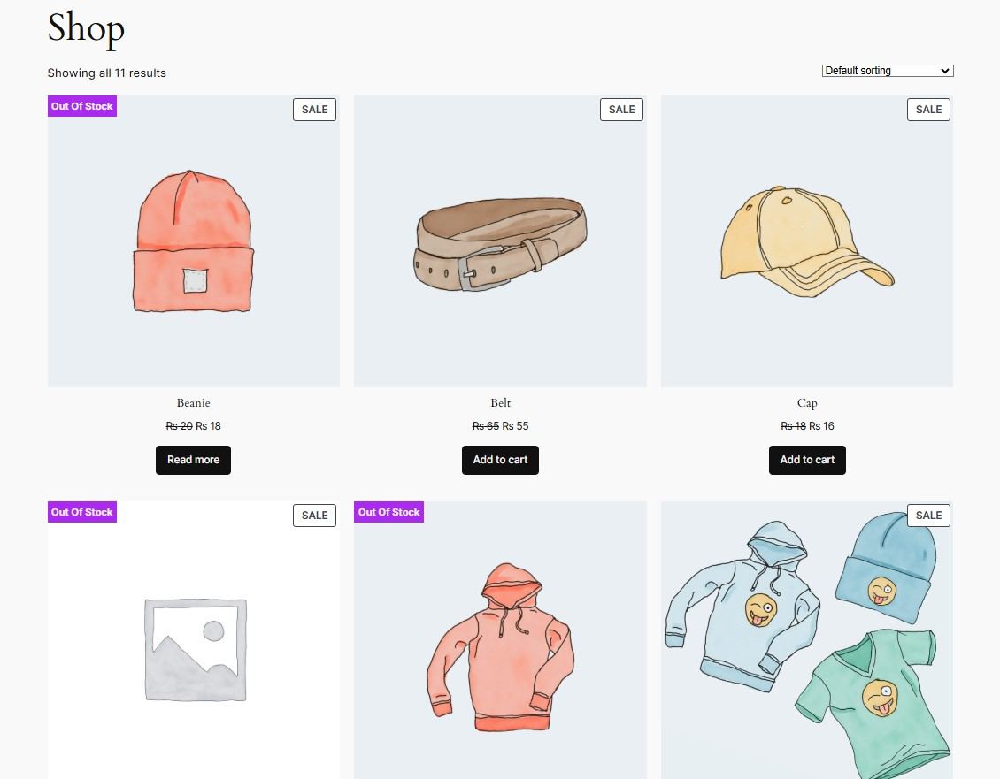
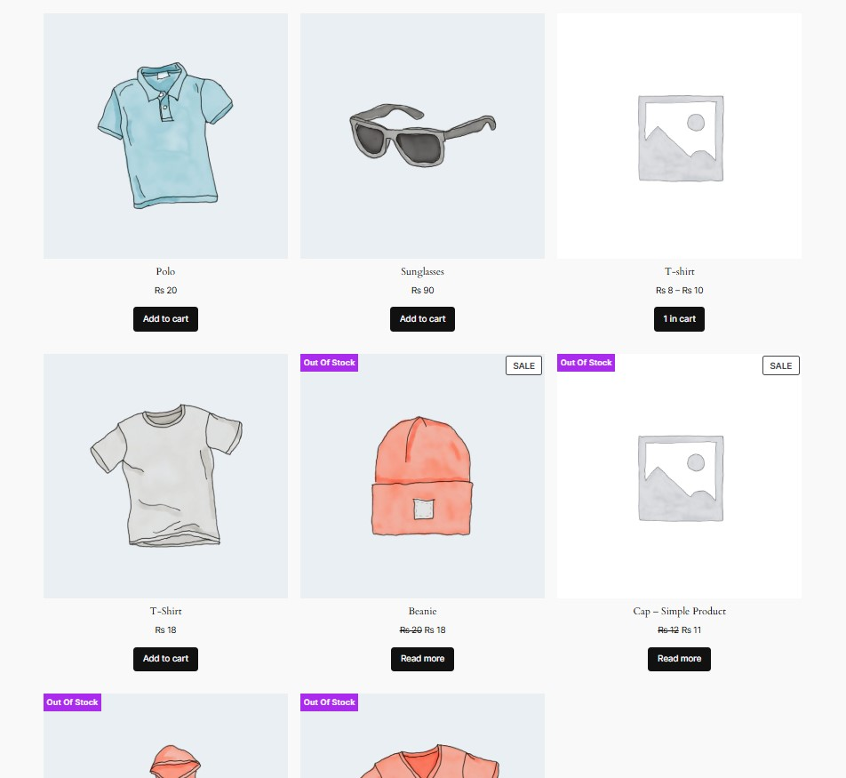

=== Push Out-of-Stock Products ===
Contributors: Hamza-crypto
Donate link: https://www.paypal.com/donate?hosted_button_id=your_button_id
Tags: WooCommerce, out-of-stock, product sorting, WooCommerce customization
Requires at least: 5.0
Tested up to: 6.7.1
Stable tag: 1.0.0
Requires PHP: 7.4
License: GPLv2 or later
License URI: https://www.gnu.org/licenses/gpl-2.0.html

Push out-of-stock products to the end of product listings in WooCommerce.

== Description ==

The "Push Out-of-Stock Products" plugin for WooCommerce automatically reorders your product listings by pushing out-of-stock products to the bottom. It helps to keep your shop pages focused on in-stock items, enhancing the shopping experience by prioritizing available products.

This plugin works on WooCommerce shop pages, product category pages, and product tag pages, ensuring that out-of-stock items are always displayed at the end of the list, without any manual intervention.

### Features

- Automatically reorders product listings.
- Pushes out-of-stock products to the end on:
  - Shop pages
  - Product category pages
  - Product tag pages
- No configuration required – install and go.
- Lightweight and simple to use.

### Installation

1. Upload the plugin through the WordPress admin dashboard or via FTP.
2. Activate the plugin from the **Plugins** page.
3. The plugin will automatically push out-of-stock products to the bottom of the list on WooCommerce pages.

== Frequently Asked Questions ==

= Will this plugin affect my existing product pages? =
No, the plugin only modifies the order of the product listings, and no content is altered.

= Can I control the product sorting order? =
Currently, the plugin sorts products based on their stock status, with out-of-stock products placed at the bottom. Future versions may include more advanced sorting options.

== Screenshots ==

1. **Shop Page without Sorted Products**  
     
   The product list with out-of-stock items in the middle.

2. **Product Category Page with Sorted Products**  
     
   Out-of-stock products are placed at the end of the list.

== Changelog ==

= 1.0.0 =

- Initial release. Push out-of-stock products to the end of WooCommerce product listings.
